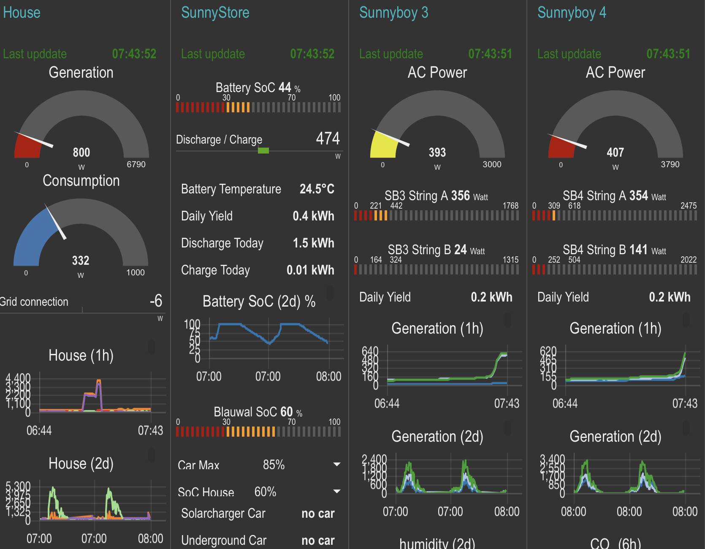

## sma2mqtt Overview

The __sma2mqtt__ tool is designed to discover SMA devices, such as inverters and Sunny HomeManagers, on a local network. It identifies the data these devices can publish and subsequently delivers this information to an MQTT server.

Within the local network, __sma2mqtt__ joins the SMA multicast to listen to announcements from Sunny HomeManager. Please note, this functionality is strictly limited to the local network due to the inherent restrictions of multicast.

The repository includes a build.sh shell script that constructs a Docker container encapsulating the __sma2mqtt__ tool. It's likely necessary to adjust this script to suit the specifics of individual Docker setups.

Upon execution, __sma2mqtt__ produces output on MQTT similar to the one shown on the left, which in turn can be used to drive a node-red dashboard shown on the right.



## Docker Container Use

A Docker image, specifically engineered for 64-bit ARM architecture, is available. This image is compatible with a range of devices, including the Raspberry Pi, Apple Silicon Macs, and other 64-bit ARM computers. It can be employed directly using the following command:
```
docker run --name "sma2mqtt" --net service16  jollyjinx/sma2mqtt:latest sma2mqtt --inverter-password MySimplePassword
```

The --net option is included in this command to specify a separate network for SMA devices. If there is no dedicated network in use, port 9522 should be open for the container.


## Usage


```
USAGE: sma2mqtt <options>

OPTIONS:
  --log-level <log-level> Set the log level. (default: debug)
  --json-output           send json output to stdout
  --mqtt-servername <mqtt-servername>
                          MQTT Server hostname (default: mqtt)
  --mqtt-port <mqtt-port> MQTT Server port (default: 1883)
  --mqtt-username <mqtt-username>
                          MQTT Server username (default: mqtt)
  --mqtt-password <mqtt-password>
                          MQTT Server password
  -e, --emit-interval <emit-interval>
                          Minimum Emit Interval to send updates to mqtt Server. (default: 1.0)
  -b, --basetopic <basetopic>
                          MQTT Server topic. (default: example/sma/)
  --bind-address <bind-address>
                          Multicast Binding Listening Interface Address. (default: 0.0.0.0)
  --bind-port <bind-port> Multicast Binding Listening Port number. (default: 9522)
  --mcast-address <mcast-address>
                          Multicast Group Address. (default: 239.12.255.254)
  --mcast-port <mcast-port>
                          Multicast Group Port number. (default: 9522)
  --inverter-password <inverter-password>
                          Inverter Password. (default: 0000)
  --interesting-paths-and-values <interesting-paths-and-values>
                          Array of path:interval values we are interested in (default: dc-side/dc-measurements/power:2, ac-side/grid-measurements/power:2, ac-side/measured-values/daily-yield:30, battery/state-of-charge:20, battery/battery/temperature:30,
                          battery/battery-charge/battery-charge:20)
  -h, --help              Show help information.

```

The option __--interesting-paths-and-values__ is currently defaulted to the things I like to see, but you probably have different needs. To find out what your inverter supports you can use the catch all argument __\*:600__ which will show all paths your inverter supports.

__sma2mqtt__ does support signaling. When you send:

- __SIG_USR1__:  it switches the log level between trace/debug/info.
- __SIG_USR2__: it prints the description of the SMALighthouse object including all currently used SMADevices and their state.


So you can use ```killall -USR2 sma2mqtt``` in a shell to let __sma2mqtt__ print out the SMALighthouse status.
