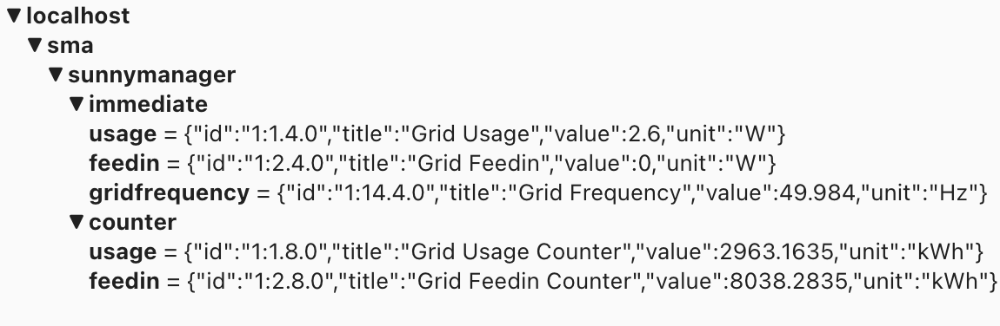
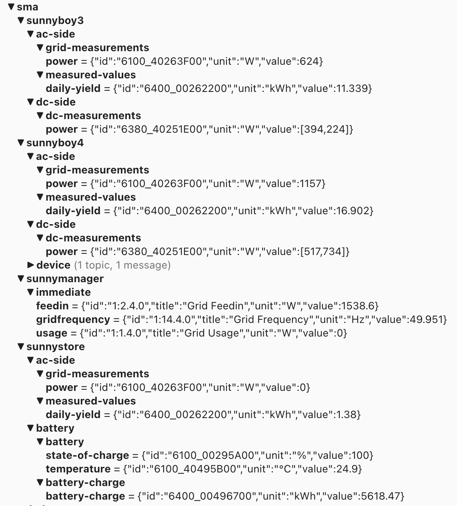

# SMA SpeedWire and Home Manager

Tools to get SMA live data feed published to MQTT.

## sma2mqtt

__sma2mqtt__ reads data from Sunny HomeManager and publishes the data to MQTT.
__sma2mqtt__ joins the SMA multicast and listens to the announcements that Sunny HomeManager does in that group. It works only inside the local network as multicast only works there.

Inside the repository is a *build.sh* shell script that creates a docker container with __sma2mqtt__ inside. You need to adjust it to your needs, as your docker setup is probably different than mine.

Output of __sma2mqtt__ will look like this on a mqtt broker:



Or if you change the obisdefinitions to show all values it will look more like this:




## Future

I use __sma2mqtt__ in 'production' and it works fine. Inverter values are currently read out via modbus, but I started reversing the [SMA inverter protocol](SMA%20Protocol.md) to get __sma2mqtt__ read values from all SMA products via UDP. SMA Speedwire protocol seems to be more stable and faster than Modbus, that's why I want to switch.

### Usage


```
USAGE: sma2mqtt <options>

OPTIONS:
  --log-level <log-level> Set the log level. (default: notice)
  --json                  send json output to stdout
  --mqtt-servername <mqtt-servername>
                          MQTT Server hostname (default: mqtt)
  --mqtt-port <mqtt-port> MQTT Server port (default: 1883)
  --mqtt-username <mqtt-username>
                          MQTT Server username (default: mqtt)
  --mqtt-password <mqtt-password>
                          MQTT Server password
  -i, --interval <interval>
                          Interval to send updates to mqtt Server. (default: 1.0)
  -b, --basetopic <basetopic>
                          MQTT Server topic. (default: sma/)
  --bind-address <bind-address>
                          Multicast Binding Listening Interface Address. (default: 0.0.0.0)
  --bind-port <bind-port> Multicast Binding Listening Port number. (default: 9522)
  --mcast-address <mcast-address>
                          Multicast Group Address. (default: 239.12.255.254)
  --mcast-port <mcast-port>
                          Multicast Group Port number. (default: 9522)
  --inverter-password <inverter-password>
                          Inverter Password. (default: 0000)
  --interesting-paths <interesting-paths>
                          Paths we are interested to update (default: dc-side/dc-measurements/power, ac-side/grid-measurements/power, ac-side/measured-values/daily-yield, immediate/feedin, immediate/usage, battery/state-of-charge, battery/battery/temperature,
                          battery/battery/battery-charge/battery-charge, temperatures)
  -h, --help              Show help information.

```


### Example 

Start with --json option which will print the json that is sent to the mqtt server to stdout. jq is used just for formatting.
```
$./sma2mqtt --json |jq . 
{
  "id": "1:4.4.0",
  "title": "Reactive Feedin",
  "topic": "immediate/reactivefeedin",
  "value": 103.4,
  "unit": "W"
}
{
  "id": "1:4.8.0",
  "title": "Reactive Feedin Counter",
  "topic": "counter/reactivefeedin",
  "value": 3544.3821,
  "unit": "kWh"
}
{
  "id": "1:9.4.0",
  "title": "Apparent Usage",
  "topic": "immediate/apparentusage",
  "value": 104.8,
  "unit": "W"
}
{
  "id": "1:9.8.0",
  "title": "Apparent Usage Counter",
  "topic": "counter/apparentusage",
  "value": 4246.7811,
  "unit": "kWh"
}
.
.
.
```


