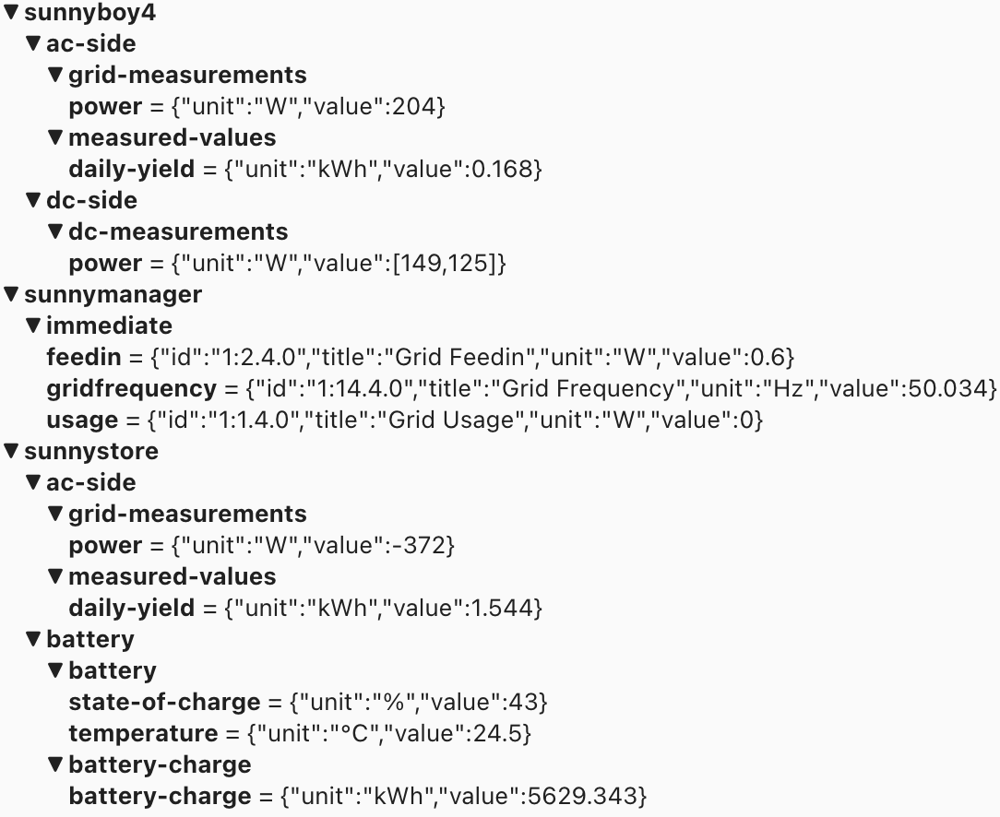

# sma2mqtt

sma2mqtt discovers SMA solar devices on a local network, decodes Sunny Home Manager and inverter data, and publishes normalized values to MQTT. It combines multicast discovery, HTTP device bootstrap, SMA Speedwire/UDP polling, bundled object metadata, and configurable publication throttling.



## How it works

1. `SMALighthouse` joins the configured SMA multicast group and periodically sends discovery packets.
2. Each discovered address is represented by an `SMADevice` actor.
3. A device first attempts HTTPS/HTTP bootstrap to learn its name, object metadata, translations, and supported object IDs.
4. Inverters are polled over SMA UDP; Sunny Home Manager OBIS announcements are decoded directly from multicast.
5. Values are normalized and published below the configured MQTT base topic.

HTTP bootstrap failure does not stop UDP discovery. Bundled metadata and translations provide a fallback when device-specific resources cannot be loaded.

## Requirements

- Swift 6.3 or later for source builds
- macOS 15 or iOS 18 for the declared Apple library platforms, or Linux through the container build
- Network reachability to the SMA devices and MQTT broker
- SMA multicast access, by default `239.12.255.254:9522`

Multicast is local-network scoped. Container networking must expose the relevant interface and UDP traffic; a default bridged network often cannot receive LAN multicast without additional configuration.

## Run a container

The GitHub Container Registry workflow publishes `linux/amd64` and `linux/arm64` images:

- `latest` and `main` from `main`;
- `development` from the development branch/tag and development prerelease tags;
- `beta` from beta tags/prereleases;
- semantic-version tags such as `3.3.1` from matching Git tags.

Attach the container to a network that can reach the SMA multicast group and the broker:

```sh
docker run --rm \
  --name sma2mqtt \
  --network host \
  --env INVERTER_PASSWORD \
  ghcr.io/jollyjinx/sma2mqtt:latest \
  sma2mqtt \
  --mqtt-servername 127.0.0.1 \
  --basetopic sma
```

Set `INVERTER_PASSWORD` in the environment before running. `--network host` is a typical Linux setup; select an equivalent network appropriate for Docker Desktop, Apple’s `container` CLI, or a dedicated VLAN.

To build locally:

```sh
docker build . --file sma2mqtt.product.dockerfile --tag sma2mqtt
docker run --rm --network host --env INVERTER_PASSWORD sma2mqtt
```

The image defines `sma2mqtt` as its default command rather than as an entrypoint. If you append options after the image name, repeat the executable name first, as in the registry example above.

## Build from source

```sh
swift build
swift run sma2mqtt --help
swift run sma2mqtt \
  --mqtt-servername mqtt \
  --basetopic sma
```

Release builds default to log level `notice` and base topic `sma/`. Debug builds default to `debug` and `example/sma/`. A trailing slash in the supplied base topic is normalized.

## Configuration

Run `sma2mqtt --help` for the authoritative option list. Important settings include:

| Option | Default | Purpose |
| --- | --- | --- |
| `--mqtt-servername` | `mqtt` | MQTT broker hostname |
| `--mqtt-port` | `1883` | MQTT broker port |
| `--mqtt-username` | `mqtt` | MQTT username |
| `--mqtt-password` | empty | MQTT password |
| `--basetopic` | `sma/` in release | Prefix for published topics |
| `--emit-interval` | `1.0` seconds | Minimum interval between publications for one topic |
| `--mqtt-unchanged-publish-interval` | `15.0` seconds | Heartbeat interval for unchanged non-retained values; `0` republishes after each emit interval |
| `--bind-address` | `0.0.0.0` | Local interface address used for SMA UDP sockets |
| `--mcast-address` | `239.12.255.254` | SMA multicast group |
| `--mcast-port` | `9522` | SMA multicast receive/send port |
| `--interesting-paths-and-values` | Selected power, yield, battery paths | Repeated `path:seconds` query selections |
| `--json-output` | off | Also print publication envelopes as JSON lines to stdout |

### Device password

The inverter password resolves in this order:

1. `--inverter-password`
2. `INVERTER_PASSWORD`
3. `0000`

Prefer the environment variable for deployments so the password is not exposed in a process argument.

### Selecting values

Pass `--interesting-paths-and-values` repeatedly with `path:interval` values. The interval controls how often that logical path is queried, in seconds. To discover all paths supported by a device, use a broad selection such as:

```sh
swift run sma2mqtt --interesting-paths-and-values '*:600'
```

Device-specific HTTP metadata can promote a better object ID for a path while retaining UDP fallback IDs for devices that expose a different mapping.

## MQTT publication behavior

- Changed values publish after the minimum emit interval.
- Unchanged, non-retained values publish as a heartbeat after the unchanged interval.
- Unchanged retained values remain suppressed because the broker already stores them.
- A reconnect resets publication history so current retained values can be sent again.
- Topics observed with multi-value array payloads retain their array shape on later single-value updates.
- MQTT username and password options are passed to the broker connection.

`--json-output` mirrors accepted publications to stdout; it does not disable MQTT delivery.

## Signals

- `SIGUSR1` cycles log levels `debug -> trace -> info -> debug` and then dumps lighthouse state.
- `SIGUSR2` dumps lighthouse and device state without changing the level.

For example:

```sh
kill -USR2 "$(pgrep -x sma2mqtt)"
```

## Current limitations

- `--bind-port` is parsed, but `SMALighthouse` currently ignores it and listens on `--mcast-port`.
- Multicast, live inverter login, and MQTT delivery require environment-specific integration testing; the default tests do not contact hardware or a broker.
- The Docker build resolves the newest dependency versions allowed by `Package.swift` because it does not copy a lockfile. Container and local dependency graphs can therefore differ.
- `build.sh` is a host-specific legacy launcher with an inline password placeholder, Docker Hub image name, and dedicated `service16` network. Review it before use; prefer explicit deployment configuration.

## Development and tests

```sh
swift package dump-package
swift build
swift test
swift build -c release --product sma2mqtt
```

The default suite covers packet decoding/generation, object metadata, query fallback behavior, MQTT publication gating, payload shape stability, password precedence, and signal-level cycling. Live-device tests are opt-in:

```sh
SMA_INTEGRATION_TESTS=1 swift test
swift test -- --pcap-file /path/to/fixture.pcap
```

Only enable integration tests on a network containing the expected SMA devices. See [`AI/ARCHITECTURE.md`](AI/ARCHITECTURE.md) and [`AI/OPERATIONS.md`](AI/OPERATIONS.md) before changing runtime behavior. The reverse-engineering notes in [`SMA Protocol.md`](SMA%20Protocol.md) are observational and may be incomplete.

The MQTT transport uses the `main` branch of the [`jollyjinx/mqtt-nio`](https://github.com/jollyjinx/mqtt-nio) fork, which carries a required mqtt-nio bug fix. Local resolutions are pinned in `Package.resolved`; container builds resolve the current tip of that branch.

## Publishing images

`ghcrupload.sh` publishes one tag for the local architecture using Apple’s `container` CLI, or a joined amd64/arm64 image with `--all-arch` and Docker Buildx. It reads the GHCR token from a macOS Keychain item; see the script header and `--help` before use. Publishing changes external state and is not part of ordinary validation.

## License

sma2mqtt is available under the [MIT License](LICENSE).
